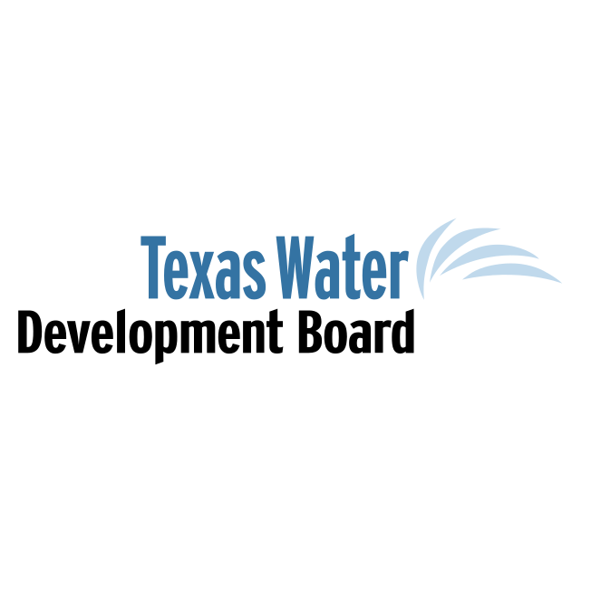
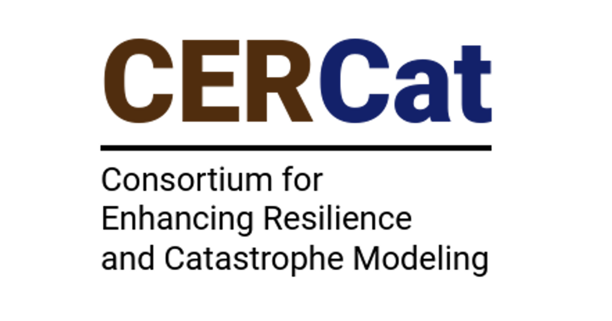
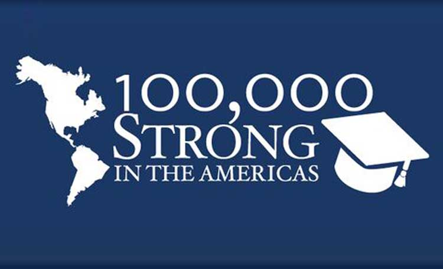
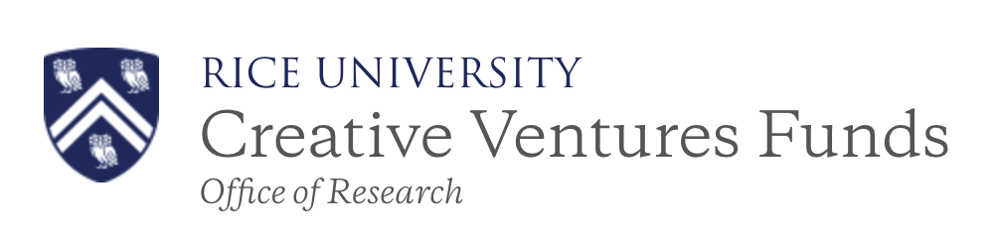

Urban climate risks are growing, but so is the complexity of managing them.
For example, planners managing flood risks must choose how to design, prioritize, and sequence combinations of green and gray infrastructure, centralized and decentralized systems, drainage and retention across a city or watershed.
Our research asks:

- How are rainfall extremes, tropical cyclones, and other climate hazards changing, and how do we represent associated uncertainty?
- How do those hazards propagate through urban systems to create risk for communities and infrastructure?
- How can planners make robust investment decisions despite deep uncertainty in future conditions?

We explore these questions through four interrelated research themes:

::: {.grid .mb-5}

::: {.g-col-12 .g-col-md-6}
::: {.callout-note appearance="minimal" icon=false .research-card}
## Probabilistic Hydroclimate Hazard

Design standards for flood infrastructure typically assume a stationary climate and spatial uniformity.
Yet rainfall extremes are intensifying, and their space-time structure shapes downstream impacts.
We develop hierarchical Bayesian models and generative machine learning methods that characterize nonstationary hydroclimate extremes and produce realistic scenarios for decision-relevant analysis.

**Read more:** [@liu_generative:2025](/bibliography/publications/article/liu_generative_2025.qmd), [@lu_spatiotemporal:2025](/bibliography/publications/article/lu_spatiotemporal_2025.qmd).
:::
:::

::: {.g-col-12 .g-col-md-6}
::: {.callout-note appearance="minimal" icon=false .research-card}
## AI-Accelerated Flood Modeling

Physics-based 2D hydrodynamic models illuminate urban flood behavior, but they omit critical processes, are difficult to build, and are too expensive to run at the ensemble sizes that uncertainty quantification demands.
We develop physics-informed machine learning emulators — including graph neural networks — that simulate compound urban flood processes rapidly and at high resolution.

**Read more:** [@kazadi_floodgnn-gru:2024](/bibliography/publications/article/kazadi_floodgnn-gru_2024.qmd), [@kazadi_icml:2024](/bibliography/publications/conference/kazadi_icml_2024.qmd).
:::
:::

::: {.g-col-12 .g-col-md-6}
::: {.callout-note appearance="minimal" icon=false .research-card}
## Infrastructure and Systems Risk

Flood hazard becomes risk only when it interacts with people, buildings, and infrastructure.
Working with structural engineers, economists, and community partners, we quantify how flooding translates into damage, disruption, and cascading consequences — from flooded roads that sever access to medical and emergency services to infrastructure failures that propagate across interconnected systems.

**Read more:** [@rozer_lossestimates:2019](/bibliography/publications/article/rozer_lossestimates_2019.qmd), [@doss-gollin_txtreme:2021](/bibliography/publications/article/doss-gollin_txtreme_2021.qmd), [@pollack_unsafe:2025](/bibliography/publications/article/pollack_unsafe_2025.qmd).
:::
:::

::: {.g-col-12 .g-col-md-6}
::: {.callout-note appearance="minimal" icon=false .research-card}
## Adaptive Decision Making Under Uncertainty

Planning flood resilience is a combinatorial problem: which mix of green and gray, centralized and decentralized investments to deploy, where, and in what sequence.
Current guidance offers little help.
We develop decision frameworks that help planners sequence and prioritize investments, balance competing objectives, and adapt as conditions and knowledge evolve under deep uncertainty.

**Read more:** [@doss-gollin_subjective:2023](/bibliography/publications/article/doss-gollin_subjective_2023.qmd), [@zhou_mesoscale:2023](/bibliography/publications/article/zhou_mesoscale_2023.qmd).
:::
:::
:::

## Research Support

We would like to thank the following organizations for their research funding and/or in-kind support.

### Active Support

::: {.grid .justify-content-center .align-items-center}

::: {.g-col-6 .g-col-md-3 .text-center}
{target=_blank}
:::

::: {.g-col-6 .g-col-md-3 .text-center}
{target=_blank}
:::

::: {.g-col-6 .g-col-md-3 .text-center}
{target=_blank}
:::

::: {.g-col-6 .g-col-md-3 .text-center}
{target=_blank}
:::

:::

### Past Support

::: {.grid .justify-content-center .align-items-center}

::: {.g-col-6 .g-col-md-3 .text-center}
{target=_blank}
:::

::: {.g-col-6 .g-col-md-3 .text-center}
{target=_blank}
:::

::: {.g-col-6 .g-col-md-3 .text-center}
{target=_blank}
:::

::: {.g-col-6 .g-col-md-3 .text-center}
{target=_blank}
:::

:::
